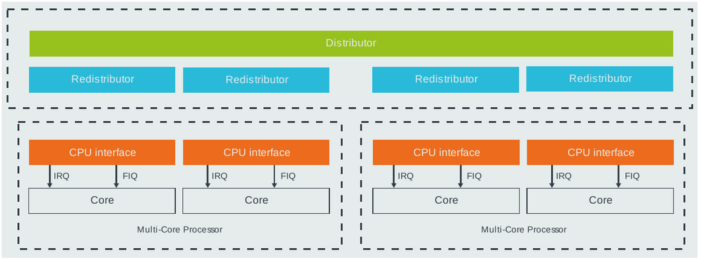

# mini-virt 的 GICv3：从设备电平到 Linux 中断处理

## 1. 中断上报与处理

GIC（Generic Interrupt Controller）解决三个问题：**哪个中断发生了、应该交给哪个
PE（Processing Element，可先理解为一个 CPU core）、它现在是否有资格打断这个 PE**。
CPU 接收到 IRQ 后解决另一个问题：保存执行现场，进入异常向量。Linux 再向 GIC
领取 INTID，找到相应 driver。这些步骤属于不同层，不能合并为“设备调用中断函数”。

本文围绕本仓库 `mini-virt`，以 PL011 UART 和 Arm Generic Timer（下文简称 GT）
为主线。使用 Cortex-A57、两个 vCPU、TCG 软件仿真，无 guest hypervisor、ITS/MSI
实验。QEMU 可以实现更多 GICv3/v4 功能，但不能把模型的全部能力视为这块板的连线。

```text
UART 收到 host 输入                         CPU0 的 physical timer 到期
  PL011 FIFO / interrupt status               CNTP_CVAL 与 counter 比较
    UART combined IRQ = 1                       CPU0 timer output = 1
      GIC SPI 1 → INTID 33                         CPU0 PPI 14 → INTID 30
        Distributor: IROUTER[33] → CPUx              Redistributor[CPU0]
          为 CPUx 选择最高优先级 pending              为 CPU0 选择 pending
          --------------------------------------------------------------
            CPU interface: group / PMR / running priority 检查
              CPU IRQ 输入 = 1
                CPU_INTERRUPT_HARD
                  TCG vCPU 执行循环检查可否接受 IRQ
                    保存 ELR / SPSR，设置 PSTATE 和 PC = VBAR + offset
                      Linux vector → gic_handle_irq()
                        MRS ICC_IAR1_EL1 → 得到 33 或 30，GIC 设置 active
                          EOIR priority drop（本次 split mode）
                          irq_domain → Linux IRQ → driver handler
                            外设消除中断原因，撤销输入电平
                          DIR deactivate
                      ERET 恢复执行上下文
```

上图是**跨 host 事件循环、vCPU 执行循环和 guest 的因果链**，不是一个连续的 host
C call stack。`qemu_set_irq()` 内部是同步函数调用，但 CPU 执行 guest vector 是
后续 vCPU 调度的工作。第 10 节给出实际 GDB backtrace 和 trace。

源码基线：QEMU `a5ed11b21a`，Linux `31e35d15d55a`；本次重新运行
`vm/aarch64/mini-virt/build-all.sh` 后采集。文中的源码路径和函数名针对该 checkout。

## 2. 架构划分：GICD、GICR、CPU interface

### 2.1 三个模块分别拥有哪一部分状态

| 模块 | 作用范围 | 主要责任 | 软件访问方式 |
| --- | --- | --- | --- |
| Distributor，GICD | 整个 GIC | SPI enable、pending、active、priority、group、目标 affinity | MMIO，`GICD_*` |
| Redistributor，GICR | 每个 PE 一份 | 该 PE 的 SGI/PPI enable、pending、active、priority；还有 LPI、睡眠协作相关状态 | MMIO，`GICR_*` |
| CPU interface，CPUif | 每个 PE 一份 | 从该 PE 的候选中断中决定是否通知 CPU；acknowledge、priority drop、deactivate | GICv3 主要使用 `ICC_*_EL1` system registers |
| Arm PE 异常逻辑 | 每个 PE 一份 | DAIF、EL 路由、保存返回状态、进入 VBAR 向量 | CPU 架构寄存器和异常机制 |



图：Arm [GICv3/4 Software Overview（DAI0492）](https://developer.arm.com/documentation/198123/latest/)
第 17 页的 Programmer's model 图，已裁去页眉、正文和版权页脚，
仅保留硬件模块关系。

CPU interface 属于 GIC 的架构接口。它通过 CPU 的 system-register instruction
访问，不意味着所有状态都应塞进 QEMU 的 `ARMCPU`。QEMU 把 GIC 状态留在 GIC
对象中，再把寄存器回调注册到 CPU。这正好把“谁保存状态”和“从哪里访问状态”分开。

真实硬件中，SPI 的物理路径是：外设 IRQ pin → Distributor 的 SPI 输入逻辑 →
Interrupt Routing Infrastructure（GIC 内部路由网络）→ 目标 PE 侧的 Redistributor /
CPU interface → core 的 IRQ 或 FIQ pin。`GICD_IROUTER<n>` 选择的是目标 PE 的
affinity；具体 IP 用什么片上互连、是否把 Redistributor 和 CPU interface 做成相邻
电路，属于实现选择。图中 Distributor 到各个 Redistributor 的连线正是在表达这条
内部路由网络。

SPI 到达目标 PE 侧时不会变成 PPI：SPI 的 enable、pending、active、priority 和
route 仍是 Distributor 的全局状态；目标 Redistributor 仍只拥有该 PE 的 SGI/PPI
（以及 LPI 相关）私有状态。CPU interface 从两侧的候选中断中选出可抢占者：一侧是
路由来的 SPI，另一侧是本地 Redistributor 的 SGI/PPI，然后才对 core assert IRQ/FIQ。

QEMU 为了计算效率没有逐拍模拟上述内部互连。它通过 `GICD_IROUTER` 得到目标
`GICv3CPUState *`，在 `gicv3_update_noirqset()` 中直接将 SPI 候选与该核的状态
关联；`gicv3_full_update_noirqset()` 再把 SPI 与每个 Redistributor 的本地候选合并，
最后由 `gicv3_cpuif_update()` 驱动该 core 的 IRQ/FIQ 输入。这是对硬件可观察语义的
软件模型，不代表真实 GICD 用一根软件指针直接连到 CPU。

### 2.2 中断种类与编号

| 种类 | 常规 GICv3 INTID | 来源、归属 | mini-virt 中的例子 |
| --- | --- | --- | --- |
| SGI | 0–15 | 软件生成，发送到指定 PE；各 PE 有自己的状态 | Linux SMP IPI |
| PPI | 16–31 | PE 私有，不能像 SPI 一样用 IROUTER 改绑到另一核 | 每核 physical timer，INTID 30 |
| SPI | 32–1019 | 系统共享外设，通过 affinity 路由到目标 PE | UART INTID 33 |
| 特殊编号 | 1020–1023 | 特殊 acknowledge 结果，不是普通设备中断 | 1023：spurious / 没有可领取的中断 |
| LPI | 从 8192 开始 | message-based interrupt，配置和 pending 表可在内存中，常与 ITS 配合 | 本实验不使用 |

后续 GIC 扩展还包括扩展 PPI/SPI、NMI 等，不在本文主路径中。
SPI 的 “Shared” 表示它是系统范围资源、可选择目标，不表示每次广播到全部 CPU，
也不等同于 Linux `IRQF_SHARED` 所说的多个设备共享一条 Linux IRQ。

### 2.3 本板的地址和实际连线

权威来源是 [mini-virt.c](../qemu/hw/arm/mini-virt.c) 的 `create_gic()`、
`create_uart()`，以及 [mini-virt.dts](../linux/arch/arm64/boot/dts/demo/mini-virt.dts)。

| 资源 | mini-virt 配置 |
| --- | --- |
| GICD MMIO | `0x08000000`，64 KiB |
| GICR region 起点 | `0x080a0000`；本板保留范围大小 `0x00f60000` |
| CPU0 / CPU1 的 GICR | `0x080a0000` / `0x080c0000`；GICv3 每个 RD+SGI frame 共 128 KiB |
| PL011 MMIO | `0x09000000` |
| GIC `num-irq` | `256 + 32 = 288`，即实现 256 根 SPI，INTID 32–287 |
| UART | SPI index 1，INTID 33，level-high |
| physical timer | 每核 PPI index 14，INTID 30，level-high |

DTS 的 `<type number flags>` 是软件描述，**不会替 QEMU 自动接线**：

```text
UART: interrupts = <0 1 4>
  type=0: SPI
  hwirq / INTID = 32 + 1 = 33
  flags=4: level-high

Timer 的 non-secure 项: <1 14 4>
  type=1: PPI
  hwirq / INTID = 16 + 14 = 30
  flags=4: level-high
```

Timer DTS 还列出 secure、virtual、hypervisor 项，但 `create_gic()` 实际只把
每个 CPU 的输出 0，即 `GTIMER_PHYS`，连到 non-secure EL1 physical timer PPI。
本次 Linux 启动日志明确选择 `(phys)`，`/proc/interrupts` 也显示 INTID 30。
不能因为 DTS 中列了 virtual timer，就把本实验写成 CNTV / INTID 27 的路径。

## 3. QEMU 的中断连线 API：把接收端封装成可连接对象

### 3.1 `qemu_irq` 不是一个中断号

核心代码在 [irq.h](../qemu/include/hw/irq.h)、
[irq.c](../qemu/hw/core/irq.c)、[gpio.c](../qemu/hw/core/gpio.c)。
忽略 QOM 对象头后，接收端的数据模型可以简化为：

```c
/* 结构示意：qemu_irq 是 IRQState * */
struct IRQState {
    qemu_irq_handler handler;
    void *opaque;
    int n;
};

/* qemu/hw/core/irq.c，实际调用逻辑 */
void qemu_set_irq(qemu_irq irq, int level)
{
    if (!irq)
        return;

    irq->handler(irq->opaque, irq->n, level);
}
```

这里的三个字段形成一个“带上下文的函数调用”：`handler` 指向接收者逻辑，`opaque`
指向接收者实例，`n` 表示接收者的第几根输入。发送者只保存这个对象的指针。
它既不需要知道接收者的 C 类型，也不需要知道这条线最终通向哪个 core。

`qemu_set_irq()` 不生成 guest 异常，不查询 Linux IRQ，也不维护 GIC pending。
它甚至不负责去重相同电平：是否忽略重复 level、是否锁存边沿，交给接收端处理。
`qemu_irq_raise()` / `qemu_irq_lower()` 分别包装 level 1 / 0；短脉冲只适用于确实
采用相应边沿语义的输入，不能把 level interrupt 都实现成“拉高后立即拉低”。

### 3.2 init in、init out、connect 各自做什么

| API | 实际意义 |
| --- | --- |
| `qdev_init_gpio_in(dev, handler, count)` | 分配 count 个 `IRQState` 输入端点，保存 handler、dev 上下文和各自 index |
| `qdev_init_gpio_out(dev, pins, count)` | 把设备自己的 `qemu_irq pins[]` 存储位置暴露为 QOM link；初始为 NULL |
| `qdev_get_gpio_in(dev, n)` | 取得输入端点对象，即 handler + opaque + n |
| `qdev_connect_gpio_out(src, out, input)` | 设置 output link，使源设备的 `pins[out]` 指向该 input 对象 |
| `sysbus_init_irq(sbd, &pin)` | 通过 SysBus 的命名 GPIO 输出组注册 IRQ 输出 |
| `sysbus_connect_irq(sbd, out, input)` | 连接 SysBus IRQ 输出；底层仍是 qdev GPIO link |
| `qemu_set_irq(pin, level)` | 调用已连接接收端的 handler |

`qdev_connect_gpio_out(dev, out, input)` 中，`dev` 是源设备，`out` 是源设备的输出端口编号，
`input` 是目标设备已初始化的 `qemu_irq` 输入端点。

最容易忽略的是：**init out 注册的是指针槽位，而不是另一套独立的接收回调**。
`qdev_init_gpio_out_named()` 用 `object_property_add_link(..., &pins[i], ...)`
把属性和真实成员绑定起来；connect 改属性，设备里的 `pins[i]` 随之指向输入对象。
这使 board 的连线声明能够直接决定设备运行时的调用目标。

更精确地说：

- **GIC 接收端持有回调**：`qdev_init_gpio_in(gic, gicv3_set_irq, 320)` 创建
  `IRQState`，写入 `handler`、`opaque` 和输入序号 `n`
- **PL011 发送端持有槽位**：`s->irq[0]` 是 `qemu_irq` 指针，初始化时为 `NULL`
- **`sysbus_init_irq()` 注册输出端**：最终以 QOM link 关联 `&s->irq[0]`，等待 board
  的 `connect` 为它接入某个输入端

因此，“空的”不是一个尚未赋值的函数指针；`s->irq[0]` 的类型是 `qemu_irq`
（即 `IRQState *`），它是一个尚未接线的输出端点。`connect` 不会把
`gicv3_set_irq` 复制给 PL011，也不会修改 GIC 输入端的 `handler`。它取得既有的
GIC `IRQState`，再通过 `object_property_set_link()` 把它的地址赋入
`s->irq[0]`；这个 strong QOM link 同时保证接收端对象在连线存在期间有效。

```text
GIC（接收端与发送端）
  input[1] ──> IRQState { handler=gicv3_set_irq, opaque=gic, n=1 }
  cpu[0].parent_irq = NULL                // GIC 的 CPU0 IRQ 输出槽位

ARMCPU0（接收端）
  input[ARM_CPU_IRQ=0]
    ──> IRQState { handler=arm_cpu_set_irq, opaque=cpu0, n=0 }

PL011（发送端）
  s->irq[0] = NULL

board 的 connect 阶段
  sysbus_connect_irq(pl011, 0, qdev_get_gpio_in(gic, 1))
    s->irq[0] = GIC input[1]
  sysbus_connect_irq(gicbusdev, 0, qdev_get_gpio_in(cpu0, ARM_CPU_IRQ))
    gic.cpu[0].parent_irq = ARMCPU0 input[0]

PL011 运行时 assert
  qemu_set_irq(s->irq[0], 1)
    gicv3_set_irq(gic, 1, 1)              // SPI index 1 → INTID 33
      gicv3_update() → gicv3_cpuif_update(cpu0)
        qemu_set_irq(gic.cpu[0].parent_irq, 1)
          arm_cpu_set_irq(cpu0, ARM_CPU_IRQ, 1)
            CPU_INTERRUPT_HARD

CPU0 随后的 TCG vCPU 执行循环
  arm_cpu_exec_interrupt()                // 检查 DAIF 和异常目标 EL
    arm_cpu_do_interrupt_aarch64()
      保存 ELR_ELx / SPSR_ELx，设置异常 PSTATE
      env->pc = VBAR_ELx + IRQ vector offset
      返回执行循环，从新的 guest PC 执行 Linux vector
```

`gicv3_cpuif_update()` 只把 GIC 的 IRQ 输出线拉高；它不会在当前
`qemu_set_irq()` 调用栈中直接跳到 guest vector。TCG vCPU 在退出或完成当前
translation block 后检查 `CPU_INTERRUPT_HARD`，只有异常未被 DAIF 等状态屏蔽时，
才会进入 `arm_cpu_exec_interrupt()`。`IRQ vector offset` 也不是固定 `0x280`：
它由异常来自当前/较低 EL、使用哪个 SP 和 AArch64/AArch32 状态决定。

对应到硬件理解：PL011 有一个 IRQ **输出引脚**，GIC 有编号为 1 的 SPI **输入引脚**。
外设和 GIC 各自的内部电路早已定义好引脚语义；board 设计阶段只是把两根引脚用 wire
接起来。QEMU 的 output slot 就是“这根输出线尚未接到哪里”的位置，接收端的
`handler` 则是“输入引脚电平变化时接收芯片内部逻辑要做什么”的软件等价物。
`qemu_set_irq()` 模拟驱动该 wire 为高或低电平，随即调用接收端逻辑；它不模拟电压、
传播延迟、竞争或门级电路。也就是说，connect 对应硬件的**静态布线/SoC elaboration**，
而 `qemu_set_irq()` 对应运行时的**引脚电平变化**。

```text
接收端 GIC 初始化
  qdev_init_gpio_in(gic, gicv3_set_irq, 320)
    input[1] = { handler=gicv3_set_irq, opaque=gic, n=1 }
  sysbus_init_irq(gicbusdev, &gic.cpu[0].parent_irq)
    GIC 的 CPU0 IRQ 输出槽位 = NULL

ARMCPU0 初始化
  qdev_init_gpio_in(cpu0, arm_cpu_set_irq, 6)
    input[ARM_CPU_IRQ=0]
      = { handler=arm_cpu_set_irq, opaque=cpu0, n=ARM_CPU_IRQ }

发送端 PL011 初始化
  sysbus_init_irq(pl011, &s->irq[0])
    注册名为 sysbus-irq 的 output link；保存成员地址 &s->irq[0]

board 连线
  sysbus_connect_irq(pl011, 0, qdev_get_gpio_in(gic, 1))
    s->irq[0] → GIC input[1]
  sysbus_connect_irq(gicbusdev, 0, qdev_get_gpio_in(cpu0, ARM_CPU_IRQ))
    gic.cpu[0].parent_irq → ARMCPU0 input[ARM_CPU_IRQ]

运行时 PL011
  qemu_set_irq(s->irq[0], 1)
    gicv3_set_irq(gic, 1, 1)
      gicv3_cpuif_update(cpu0)
        qemu_set_irq(gic.cpu[0].parent_irq, 1)
          arm_cpu_set_irq(cpu0, ARM_CPU_IRQ, 1)
            CPU_INTERRUPT_HARD
```

320 来自 `256 + 32 * 2`：256 个 SPI 输入，再加每核 32 个内部编号槽位。
SGI 虽然占内部编号 0–15，却不能通过这组外部 GPIO 注入；`gicv3_set_irq()`
明确断言 PPI 分支的 INTID 必须至少为 16。SGI 使用 `ICC_SGI1R_EL1` 等生成路径。

本板实际把两个方向分别接起来，摘自 `create_gic()`：

```c
for (int i = 0; i < smp_cpus; i++) {
    DeviceState *cpudev = DEVICE(qemu_get_cpu(i));
    int intidbase = NUM_IRQS + i * GIC_INTERNAL;
    qdev_connect_gpio_out(cpudev, 0,
        qdev_get_gpio_in(vms->gic, intidbase + ARCH_TIMER_NS_EL1_IRQ));
    sysbus_connect_irq(gicbusdev, i,
        qdev_get_gpio_in(cpudev, ARM_CPU_IRQ));
}
```

第一条是 **CPU 内的 timer → GIC**，第二条是 **GIC → CPU exception 输入**。
这不是递归调用死循环：timer source 和 CPU IRQ receiver 是不同的状态与端口，
CPU 收到 IRQ 也不会同步执行 guest timer handler。UART 则使用
`sysbus_connect_irq(s, 0, qdev_get_gpio_in(vms->gic, 1))`。

### 3.3 同一个数字在不同边界代表什么

```text
UART output 0
  → GIC input 1
    → SPI index 1 + 32
      → INTID 33
        → Linux irq_domain 映射出的 virq（本次是 13）

CPU0 timer output 0
  → GIC input 256 + 0*32 + 30 = 286
    → CPU0 的 INTID 30
      → Linux per-CPU IRQ（本次是 10）

CPU1 timer output 0
  → GIC input 256 + 1*32 + 30 = 318
    → CPU1 的 INTID 30
      → 同一个 Linux per-CPU IRQ，使用 CPU1 的状态和 dev_id

GIC output CPU_index
  → 对应 CPU input ARM_CPU_IRQ = 0
    → CPU_INTERRUPT_HARD
```

注意 timer 公式加的是 **INTID 30**，不是 DTS 中的 PPI-relative index 14。
`ARCH_TIMER_NS_EL1_IRQ` 在 board 连线中已经是 INTID。

`gicv3_set_irq()` 的转换逻辑就在
[arm_gicv3.c](../qemu/hw/intc/arm_gicv3.c)：

```c
/* 摘录并简化；N = s->num_irq - GIC_INTERNAL = 256 */
if (irq < N) {
    gicv3_dist_set_irq(s, irq + 32, level);
} else {
    irq -= N;
    cpu = irq / 32;
    irq %= 32;
    gicv3_redist_set_irq(&s->cpu[cpu], irq, level);
}
```

**编号转换发生在理解该编号语义的模块边界上**。通用 GPIO 层不硬编码“加 32”，
PL011 不知道 GIC INTID，GIC 不知道 Linux virq。这正是接口能够复用的原因。

### 3.4 这种抽象像硬件，但不是电路模拟器

函数名构成清楚的操作词汇：`init` 定义端口，`connect` 定义板级拓扑，`set_irq`
传播 level，`dist/redist_set_irq` 更新接收状态，`update` 重算可观察输出。
硬件中并行运行的组合逻辑，在 QEMU 中变为“事件修改状态 → 重算 → 通知下一层”。

这不是仅仅把硬件名字换成函数名：真正对应硬件的是**状态的归属和调用契约**。
同一 GPIO 框架也可以连接 reset、enable 等信号；GIC 特有的仲裁逻辑留在 GIC 内。
它没有模拟 wire propagation delay、亚稳态或门级时序，也不是自动排队的消息总线。
跨线程执行、安全同步由 QEMU 的设备模型、BQL 和 vCPU kick 机制负责，不能从
`qemu_set_irq()` 这个极短函数推导出“任意线程都能无锁调用设备”。

## 4. 核心数据结构：原始状态与派生结果分开

主要声明在 [arm_gicv3_common.h](../qemu/include/hw/intc/arm_gicv3_common.h)。

```text
GICv3State                                  // 一整个 controller
  iomem_dist / redist_regions               // MMIO 入口
  num_cpu / num_irq / revision              // 规模和能力
  gicd_ctlr                                 // group enable / security / affinity routing
  enabled[]                                 // SPI 是否允许转发
  pending[]                                 // SPI 软件/边沿锁存的 pending
  level[]                                   // SPI 当前输入电平
  edge_trigger[]                            // SPI 触发方式
  active[]                                  // 已被领取、尚未 deactivate 的 SPI
  group[] / grpmod[]                        // security group
  gicd_ipriority[]                          // 优先级
  gicd_irouter[]                            // 架构可见的目标 affinity
  gicd_irouter_target[]                     // 从 affinity 派生的目标 CPUState 缓存
  cpu[] -> GICv3CPUState                    // 每个 PE 一份
    gic / cpu                               // 指回 controller 与 ARM CPU
    level / edge_trigger                    // 本核 SGI/PPI 输入和触发方式
    gicr_ienabler0 / ipendr0 / iactiver0    // 本核 enable / pending / active 位
    gicr_ipriorityr[32]                     // 本核 SGI/PPI 优先级
    icc_pmr_el1                             // priority mask threshold
    icc_bpr[]                               // binary point，抢占优先级分组
    icc_apr[][]                             // active priority 位图，计算 running priority
    icc_igrpen[]                            // CPUif group enable
    icc_ctlr_el1[]                          // 包含 EOImode
    hppi = { irq, prio, grp, ... }          // 此核 highest priority pending interrupt 缓存
    parent_irq                              // 接到该 ARM CPU 的 IRQ 输入对象
```

`pending[]` 与 `level[]` 必须分开。边沿到来后即使线已拉低，锁存的 pending 仍应
保留；level interrupt 则可能没有 pending latch，但仅凭持续高电平就处于 pending。
`active[]` 与 `icc_apr` 也必须分开：前者是某个 INTID 的处理生命周期，后者是
CPUif 的当前抢占门槛；EOImode=1 允许先降低后者、稍后才清除前者。

`hppi` 和 `gicd_irouter_target[]` 属于派生缓存，不能代替架构状态。迁移/恢复时
可以由寄存器和位图重建。将原始状态、仲裁结果、输出线分开，既利于迁移，也避免
“为了缓存一个计算结果，不小心发明了新的架构状态”。

| 源文件 | 阅读任务 |
| --- | --- |
| [arm_gicv3_common.c](../qemu/hw/intc/arm_gicv3_common.c) | 对象公共初始化、MMIO/GPIO、reset、迁移 |
| [arm_gicv3.c](../qemu/hw/intc/arm_gicv3.c) | GPIO 入口、SPI/PPI 候选计算、HPPI 更新 |
| [arm_gicv3_dist.c](../qemu/hw/intc/arm_gicv3_dist.c) | GICD MMIO、SPI 输入电平、IROUTER |
| [arm_gicv3_redist.c](../qemu/hw/intc/arm_gicv3_redist.c) | GICR MMIO、PPI/SGI 状态 |
| [arm_gicv3_cpuif.c](../qemu/hw/intc/arm_gicv3_cpuif.c) | ICC system registers、优先级、IAR/EOIR/DIR、物理/虚拟接口 |
| [gicv3_internal.h](../qemu/hw/intc/gicv3_internal.h) | 位图、group、affinity 等内部 helper |

文件划分也解释了复杂度：寄存器访问权限、状态转换、仲裁、对外信号是不同问题。
把所有逻辑写进“raise interrupt”函数，反而会失去这些边界。

## 5. 从 UART SPI 路由到目标 core

### 5.1 外设先决定是否 assert

[pl011.c](../qemu/hw/char/pl011.c) 的 `pl011_update()` 核心代码：

```c
flags = s->int_level & s->int_enabled;
for (i = 0; i < ARRAY_SIZE(s->irq); i++) {
    qemu_set_irq(s->irq[i], (flags & irqmask[i]) != 0);
}
```

PL011 可以暴露多个输出，本板连接 output 0 的 combined interrupt。RX、TX 等
设备内部条件先汇总并经过设备 mask，再变成一根线。`int_enabled` 是 UART 自己的
mask，不是 GIC enable，也不是 CPU DAIF。

```text
host 字符后端收到输入
  pl011_receive()
    pl011_fifo_rx_put()
      更新 RX FIFO / INT_RX
      pl011_update()
        qemu_set_irq(s->irq[0], 1)
          gicv3_set_irq(gic, 1, 1)
            gicv3_dist_set_irq(gic, 33, 1)
              level[33] = 1
              如果配置成 edge 且出现上升沿，锁存 pending[33]
              gicv3_update(gic, 33, 1)
```

不要用 earlycon 的输出作为 UART IRQ 已工作的证据：early console 可以轮询发送。
本次特意通过串口输入 shell 命令，让 RX 路径产生可确认的 SPI。

### 5.2 “pending”与“可交付候选”并不相同

`gicd_int_pending()` 先按 32 个中断一组计算候选，核心是真实源码中的位运算：

```c
pend = pending | (~edge_trigger & level);
pend &= enable;
pend &= ~active;
/* 随后根据 GICD group enable 过滤 */
pend &= grpmask;
```

这个函数名里的 pending 实际上已经带有 eligibility 过滤。一个中断可以在架构上
pending，却因为 disabled、group disabled 或已经 active 而不在返回结果中。
“mask 住”通常不等于“把事件删掉”。`Active+Pending` 也不能立即再次通知 CPU。

### 5.3 IROUTER 如何选中 CPU1

Linux 的 `gic_set_affinity()` 把目标 CPU 的 MPIDR affinity 编码成 `GICD_IROUTER<n>`。
GICv3 使用 Aff3:Aff2:Aff1:Aff0 标识 PE，不是直接把 Linux CPU number 写入通用路由表。
本板 affinity 简单，CPU0 为 0、CPU1 为 1，才有数值恰好相同的现象。

```text
Linux: echo 1 > /proc/irq/<UART virq>/smp_affinity_list
  gic_set_affinity()
    MPIDR → affinity encoding
    MMIO write GICD_IROUTER[33]
      QEMU gicd_write_irouter(s, ..., 33, 1)
        s->gicd_irouter[33] = 1
        gicv3_cache_target_cpustate(s, 33)
          提取 Aff3:Aff2:Aff1:Aff0
          与每个 GICR_TYPER 的 affinity 匹配
          s->gicd_irouter_target[33] = &s->cpu[1]
        gicv3_update(s, 33, 1)
```

`gicv3_update_noirqset()` 遍历本次受影响的候选，取得这个 cached target：

```c
cs = s->gicd_irouter_target[i];
if (!cs) {
    continue;  /* 目标 PE 不存在：保留 pending，不转发 */
}
nmi = gicv3_get_priority(cs, false, i, &prio);
if (irqbetter(cs, i, prio, nmi)) {
    cs->hppi.irq = i;
    cs->hppi.prio = prio;
    cs->hppi.nmi = nmi;
    cs->seenbetter = true;
}
```

如果变化使当前 winner 失效，则回退到 `gicv3_full_update_noirqset()`，重新比较 SPI
和各核私有中断。`*_noirqset()` 先把仲裁结果算完整，再由 `gicv3_cpuif_update()`
更新输出，避免在中间计算状态上反复通知 CPU。

架构允许的 1-of-N 路由不能直接套到这个实现上：此 checkout 的 GICD_TYPER 明确
声明 `No1N=1`，不支持 1-of-N SPI。本文验证的是 `IRM=0` 的明确 affinity 路由。
SGI 生成寄存器中的 IRM 有自己的广播语义，也不能拿来代替 SPI IROUTER 的含义。

### 5.4 选中目标不等于 CPU 立刻接受

`gicv3_cpuif_update()` 使用 `icc_hppi_can_preempt()` 检查：

```text
该核存在 HPPI
  → CPUif 对应 group 已 enable
  → priority 数值小于 ICC_PMR_EL1 阈值
  → 经 BPR 划分后的 group priority 能抢占当前 running priority
  → 根据 group / security / 当前执行环境选择 IRQ 或 FIQ
  → qemu_set_irq(cs->parent_irq, irqlevel)
```

Arm 中普通优先级通常是**数值越小，优先级越高**。BPR 将 priority 划分为抢占比较
使用的 group priority 和同组排序部分；只看完整 priority 数值还不足以描述嵌套。
本实验走 Group 1 IRQ。mini-virt 只把 GIC 的物理 IRQ 输出接到 CPU；模型还有
FIQ/VIRQ/VFIQ 等输出，不表示板上全部已经使用。

GIC 把 IRQ 拉高后，CPU 自己还会检查异常路由和屏蔽。`PSTATE.I=1` 时，GIC 仍可
保持 IRQ=1、事件仍 pending，但普通 EL1 IRQ 不会因此强行打断当前代码。

### 5.5 Level 与 edge：源头如何报告事件

`level` 和 `edge` 描述的是**设备到 GIC 输入引脚的报告协议**，不是 Linux handler
的两种写法，也不是 IRQ/FIQ 的区别。GIC 的 enable、priority、group、CPU mask 等
仲裁都发生在这层之后。

| 属性 | level-sensitive | edge-triggered |
| --- | --- | --- |
| 设备报告 | 只要中断原因存在，就持续 assert 引脚 | 事件发生时产生一次上升沿或下降沿脉冲 |
| GIC 看到什么 | 当前输入电平为高就可构成 pending | 指定边沿到来时锁存 pending |
| 设备何时撤销 | driver 清状态、读空 FIFO、写 ACK 或 mask 后，设备 deassert | 脉冲可立即结束；若设备内部另有状态 latch，driver 仍须 ACK/rearm 它 |
| 处理未完成时再次发生 | 输入仍高，deactivate 后会再次成为 pending | active 期间的新边沿可使其成为 Active+Pending；只有一个 pending 状态位，不是事件队列 |
| 典型优点 | 原因未清就不会悄悄消失，适合状态/FIFO/完成条件 | 很短的离散事件可被锁存，源不必一直维持电平 |

硬件上的两条典型时序如下。`assert` / `deassert` 是设备驱动输入引脚，`IAR`、`EOIR`
和 `DIR` 是 CPU 对 GIC 的操作；它们不是同一件事。

```text
level IRQ
  设备状态置位 / RX FIFO 非空
    → IRQ pin 保持 high
      → GIC 可交付该 INTID
        → CPU IAR：Pending → Active+Pending（pin 仍 high）
          → driver 清设备状态或读空 FIFO
            → IRQ pin low：Active+Pending → Active
              → EOIR / DIR 完成 priority drop / deactivate
                → Inactive

edge IRQ
  设备事件发生
    → IRQ pin: low → high → low
      → GIC 在指定边沿锁存 pending
        → CPU IAR：Pending → Active
          → driver 按设备语义 ACK 或 rearm 内部事件 latch
            → EOIR / DIR：Active → Inactive
```

对 level IRQ，**在最终 deactivate 前必须让设备不再 assert**。本系统的 EOImode=1
会先写 EOIR 做 priority drop、随后 handler 清设备、最后写 DIR；所以这里的“最终”
是 DIR，不是第一个 EOIR。若 DIR 时设备仍保持 high，GIC 会立即再次看到 pending，
造成重复 IRQ，极端情况下就是 interrupt storm。对 edge IRQ，不能因为引脚已经回到
low 就断定设备无须处理：很多设备以边沿通知“内部状态已变化”，仍要读状态寄存器或
清自身 latch；具体 ACK 顺序必须服从该设备手册。

#### mini-virt 中的类型与适用范围

Device Tree 的第三个 interrupt cell 是 trigger flags：`0x04` 表示
`IRQ_TYPE_LEVEL_HIGH`，`0x01` 表示 `IRQ_TYPE_EDGE_RISING`。Linux
`gic_irq_domain_translate()` 解析这个 type，`gic_set_type()` 再将它配置到 GICD/GICR
的 ICFGR。DTS 描述了硬件协议；QEMU board 的 GPIO `connect` 只定义哪两端相连，
不会因为一条线被连接就自动推断 edge 或 level。

| mini-virt 来源 | DTS 类型 | 为什么适合 |
| --- | --- | --- |
| PL011 UART，SPI 1 / INTID 33 | level-high | RX FIFO 或 UART status 未清时持续为真，`pl011_update()` 用当前 status 驱动输出 |
| 每核 physical timer，PPI 14 / INTID 30 | level-high | `ISTATUS && !IMASK` 为真时输出维持 high；handler mask/reprogram timer 后撤销 |
| SEC VF，SPI 8–11 / INTID 40–43 | level-high | 完成状态可保持到 guest driver 读取/清除，适合可靠的设备完成通知 |
| SMMUv3 eventq / priq / cmdq-sync / gerror，SPI 3–6 | edge-rising | 当前 DTS 明确声明 `0x01`；模型用 `qemu_irq_pulse()` 发出 low→high→low 脉冲 |

一般而言，UART、timer、DMA/存储完成、PCI legacy INTx 等“状态还在”的外设中断多为
level；GPIO 的按键/传感器边沿、短脉冲通知等常用 edge。SGI 是软件写 ICC_SGI 寄存器
生成的请求，LPI/MSI 是消息写入经 ITS 翻译的请求；它们不是普通外设引脚，不能简单
归为这里的 level 或 edge GPIO 线。

#### QEMU 如何保留两种硬件语义

`qemu_set_irq(irq, level)` 的参数始终是电平值。`qemu_irq_pulse()` 可以简化 edge
设备代码，但它的语义仍是一次 low→high→low 的电平变化。设备模型负责报告正确波形：
level 设备按当前条件调用 `qemu_set_irq(pin, condition)`；edge 设备调用
`qemu_irq_pulse()` 或等价地形成 `0 → 1 → 0`。对同一输入重复写入相同 level 不会
变成新事件。

[arm_gicv3_dist.c](../qemu/hw/intc/arm_gicv3_dist.c) 的
`gicv3_dist_set_irq()` 先更新 `level[]`；只有输入变为 high 且 `edge_trigger[]` 表示
edge 时，才把 `pending[]` 置位：

```c
gicv3_gicd_level_replace(s, irq, level);

if (level && gicv3_gicd_edge_trigger_test(s, irq)) {
    gicv3_gicd_pending_set(s, irq);  // 0→1 edge 锁存
}
```

随后 `gicd_int_pending()` 的核心公式同时表达两种语义：

```c
pend = pending | (~edge_trigger & level);
```

edge 使用已经锁存的 `pending` 位；level 使用当前 `level` 位。PPI 走
`gicv3_redist_set_irq()`，但 `gicr_int_pending()` 使用同一公式，只是状态属于目标核的
Redistributor。把 level 源错误配成 edge，持续 high 只会产生一次上升沿，未清源也不会
再有新的边沿；把 edge 脉冲错误配成 level，脉冲在 CPU 可服务前回到 low 时则可能丢失。
因此设备模型的波形、DTS trigger flag 和 guest 对 ICFGR 的配置必须三者一致。

第 9 节会在 `Pending`、`Active`、`Active+Pending` 和 `EOIR/DIR` 的上下文中继续展开
这两个时序。这里先抓住边界：**GIC 负责保存/仲裁中断状态；设备 driver 负责消除或
确认中断源本身的原因。**

## 6. GT PPI：目标 core 已由连线确定

GT 是 Arm CPU 架构的 timer。每核有自己的 compare/control 状态，counter 提供时间基准。
这里是 physical counter 对比 `CNTP_CVAL_EL0`；`CNTP_TVAL_EL0` 提供相对设置方式。
`CNTP_CTL_EL0` 的 ENABLE、IMASK、ISTATUS 分别表示使能、输出屏蔽和条件状态。

[helper.c](../qemu/target/arm/helper.c) 的 `gt_recalc_timer()` 使用
`QEMU_CLOCK_VIRTUAL` 对应的虚拟时间安排 `QEMUTimer`，不要求解释执行时每条指令
都轮询一次 counter：

```text
guest 写 CNTP_CVAL / TVAL / CTL
  system register write callback
    gt_recalc_timer(cpu, GTIMER_PHYS)
      比较 counter 与 cval，更新 ISTATUS
      timer_mod() 安排下一次状态变化
      gt_update_irq()

QEMU timer 到期
  timerlist_run_timers()
    arm_gt_ptimer_cb(cpu)
      gt_recalc_timer(cpu, GTIMER_PHYS)
        ISTATUS = 1
        gt_update_irq()
          irqstate = ISTATUS && !IMASK
          qemu_set_irq(cpu->gt_timer_outputs[0], irqstate)
            gicv3_set_irq(gic, 286 或 318, 1)
              gicv3_redist_set_irq(&s->cpu[0 或 1], 30, 1)
                gicv3_redist_update()
                  本核 PPI 与已有 SPI 等候选比较
                  gicv3_cpuif_update()
```

禁用 timer 时，`gt_recalc_timer()` 清 ISTATUS 并删除 timer；因此不能脱离 ENABLE
只解释 `gt_update_irq()` 中 `(ctl & 6) == 4` 这一行。到期后不立即清掉 compare
条件，输出就可能持续为高；guest handler 通常先设 IMASK，再处理 clockevent，
下一次编程 compare/control 时重新开始一个周期。

**CPU1 PPI30 和 CPU0 PPI30 是两个独立状态机**，共享 INTID 编号，不共享 enable、
active、pending 位。它们都可以同时 active。PPI 无需查 `GICD_IROUTER[30]`。

## 7. 从 IRQ 线到 TCG 设置 guest PC

### 7.1 GIC 输出只是 CPU 的请求输入

[ARM CPU GPIO handler](../qemu/target/arm/cpu.c) 的 `arm_cpu_set_irq()`：

```text
arm_cpu_set_irq(ARMCPU, ARM_CPU_IRQ=0, level=1)
  env->irq_line_state |= CPU_INTERRUPT_HARD
  cpu_interrupt(cs, CPU_INTERRUPT_HARD)
    tcg_handle_interrupt()
      cpu_set_interrupt() 设置 interrupt_request
      若目标是另一 host 线程：qemu_cpu_kick(cpu)
      若当前就是目标 vCPU：设置 icount_decr 的退出标志
```

[tcg-accel-ops.c](../qemu/accel/tcg/tcg-accel-ops.c) 中的这条路径促使执行回到
可以检查中断的位置，或唤醒正在等待的 vCPU。它不是直接调用 Linux handler。
输出变低则走清除 CPU IRQ 请求的路径；这与 GIC 的 active 位仍是不同层的状态。

### 7.2 TCG 在执行循环接受异常

```text
mttcg_cpu_thread_fn()
  tcg_cpu_exec()
    cpu_exec()
      cpu_exec_loop()
        cpu_handle_interrupt()
          ARM TCGCPUOps.cpu_exec_interrupt
            arm_cpu_exec_interrupt(cs, interrupt_request)
              看见 CPU_INTERRUPT_HARD
              arm_phys_excp_target_el() 决定目标 EL
              arm_excp_unmasked() 检查 DAIF / HCR / SCR 等
              cs->exception_index = EXCP_IRQ
              env->exception.target_el = target_el
              arm_cpu_do_interrupt()
                arm_cpu_do_interrupt_aarch64()
```

源码：[cpu-exec.c](../qemu/accel/tcg/cpu-exec.c)、
[cpu-irq.c](../qemu/target/arm/cpu-irq.c)、[helper.c](../qemu/target/arm/helper.c)。
TCG 执行的是翻译块 TB（Translation Block），需要跳出当前执行链并重新检查中断；
不能描述成 guest 的每条指令之间都完整调用一次 GIC 仲裁函数。

### 7.3 “直接跳 PC”具体做了什么

`arm_cpu_do_interrupt_aarch64()` 中与本路径直接有关的真实语句是：

```c
vaddr addr = env->cp15.vbar_el[new_el];
/* 根据异常来源加 0x200 / 0x400 / 0x600 等，再对 IRQ 加 0x80 */
/* ... */
env->elr_el[new_el] = env->pc;
/* ... */
env->banked_spsr[aarch64_banked_spsr_index(new_el)] = old_mode;
/* ... */
pstate_write(env, PSTATE_DAIF | new_mode);
env->aarch64 = true;
aarch64_restore_sp(env, new_el);
/* TCG 下还重建 hflags */
env->pc = addr;
```

QEMU 修改的是 **guest architectural PC**，不是把 host C 的函数返回地址改成 guest
向量地址。返回执行循环后，从新的 guest PC 查找或翻译 TB，再执行 Linux vector。

| 来源 | EL1 IRQ vector offset |
| --- | --- |
| 当前 EL，使用 SP_EL0 | `0x080` |
| 当前 EL，使用 SP_EL1，通常的内核上下文 | `0x280` |
| 较低 EL，AArch64，通常的用户态上下文 | `0x480` |
| 较低 EL，AArch32 | `0x680` |

offset 按“来源 EL / 执行状态 / SP 选择 / 异常类别”计算，**不按 INTID 计算**。
UART 33 和 timer 30 在同一种来源上下文下进入同一个 IRQ vector slot。
CPU 此时还没有通过 IAR 领取 INTID。

异常入口保存 ELR、SPSR 等架构返回状态并选择 SP；不会自动把 x0–x30 全压入内存。
Linux vector 汇编负责保存通用寄存器、建立 `pt_regs`。返回时 Linux 恢复寄存器，
`ERET` 按 ELR/SPSR 恢复 PC/PSTATE。QEMU 的 AArch64 exception-return helper
模拟这个动作；**ERET 不会替软件清 GIC active**。

## 8. Linux 如何从共同 vector 找到具体 handler

### 8.1 初始化先建立两套关系

Linux 启动期间做两件独立的事：

```text
irqchip 初始化
  解析 arm,gic-v3 节点
  建立 GIC irq_domain
  初始化 GICD、每核 GICR、ICC interface
  set_handle_irq(gic_handle_irq)

设备 driver 初始化
  解析设备 interrupts
  gic_irq_domain_translate(): SPI +32 / PPI +16 → hwirq
  分配 Linux IRQ，建立 hwirq → irq_desc 映射
  注册 irqaction / per-CPU handler
```

`hwirq` 在这里是 GIC INTID；`virq` 是 Linux IRQ subsystem 使用的编号，
不是 GIC virtual interrupt。PL011 的 `request_irq(..., pl011_int, ..., "uart-pl011", ...)`
把 callback 挂到 Linux IRQ descriptor。Timer 使用 per-CPU handler 和每核 clockevent。

GIC 初始化的核心并非“把所有线接上就结束”。QEMU board 的 connect 只建立拓扑，
Linux 的寄存器编程才使中断可交付：

| 配置层 | Linux 建立的条件 |
| --- | --- |
| GICD | 初始化 SPI 的 type / priority / group；设置 IROUTER 和 group enable |
| 每核 GICR | 发现 affinity 对应的 frame，处理 WAKER；设置 SGI/PPI 的私有状态 |
| 每核 CPUif | 使用 system-register interface，配置 PMR、BPR、EOImode、group enable |
| irqchip / driver startup | unmask 具体 IRQ，同时在外设自己的控制寄存器里使能事件 |
| CPU 执行上下文 | 在适当阶段允许普通 IRQ，运行中再由 local_irq 等控制 DAIF |

这些是功能上的分层，不是声称启动代码严格按表格逐行执行。源码可从
`gic_dist_init()`、`gic_cpu_init()`、`gic_cpu_sys_reg_init()` 和 `gic_unmask_irq()`
继续追踪。PPI 必须在相应 CPU 的初始化/启动路径建立本地配置，配置 CPU0 的
GICR 不会自动使能 CPU1 的 PPI。

### 8.2 vector 到 IAR，再到 irq_domain

```text
Linux arch/arm64/kernel/entry.S: vectors
  内核 IRQ → el1h_64_irq → el1h_64_irq_handler()
  用户 IRQ → el0t_64_irq → el0t_64_irq_handler()
    entry-common.c 中的 entry accounting / stack handling
      do_interrupt_handler(regs, handle_arch_irq)
        gic_handle_irq()
          __gic_handle_irq_from_irqson()        // 本文普通 IRQ 主路径
            gic_read_iar()
              MRS ICC_IAR1_EL1
                QEMU system-register helper
                  icc_iar1_read()
                    校验当前可领取的 HPPI
                    icc_activate_irq(cs, INTID)
                    返回 INTID
            __gic_handle_irq(INTID, regs)
              特殊 INTID 1020–1023：不作为普通 IRQ 分发
              gic_complete_ack(INTID)
              generic_handle_domain_irq(gic_data.domain, INTID)
                找到 irq_desc，调用 desc->handle_irq
```

这里的 MRS 是 guest 指令，它由 TCG 翻译后的代码调用 QEMU 的寄存器 helper；GDB
会看到 `helper_get_cp_reg64()` 等 host 帧，而不是在同一个 host bt 中看到 Linux 的
`gic_handle_irq()`。后者是 guest 指令执行流程，本文通过 Linux 源码连接这条边。

CPUif 的寄存器注册也使用相同的“编码 → callback”思想：

```c
/* arm_gicv3_cpuif.c：摘录 */
{ .name = "ICC_IAR1_EL1", .state = ARM_CP_STATE_BOTH,
  .opc0 = 3, .opc1 = 0, .crn = 12, .crm = 12, .opc2 = 0,
  .type = ARM_CP_IO | ARM_CP_NO_RAW,
  .access = PL1_R, .accessfn = gicv3_irq_access,
  .readfn = icc_iar1_read,
},
```

`gicv3_init_cpuif()` 对每个 ARMCPU 调用 `define_arm_cp_regs()` 注册这些描述。
TCG 解码 MRS/MSR 的寄存器编码，解析到 `ARMCPRegInfo`，再生成 helper 调用。
`icc_cs_from_env()` 从 `env->gicv3state` 找到该核的 GIC 状态，所以同一条 MRS
在 CPU0 和 CPU1 上领取的是各自接口的中断。`ARM_CP_IO` 还使
[op_helper.c](../qemu/target/arm/tcg/op_helper.c) 的 `get/set_cp_reg64` 在调用
readfn/writefn 时持有 BQL，协调这些有设备副作用的寄存器访问。IAR 因此不能当成
一个只读 C 字段加载；它会改变 active、priority 和 IRQ 输出。

### 8.3 UART 与 timer 分别使用什么 flow handler

```text
UART INTID 33
  irq_domain → 本次 Linux IRQ 13
    handle_fasteoi_irq()
      handle_irq_event() → irqaction.handler
        pl011_int()
          读取 UART status
          RX: pl011_rx_chars() → 从 DR 读出 FIFO 数据 → tty 层
          TX: pl011_tx_chars()
          根据设备原因读写 UART 寄存器，消除中断条件
      irq_chip.irq_eoi()

Timer INTID 30
  irq_domain → 本次 Linux IRQ 10，per-CPU
    handle_percpu_devid_irq()
      arch_timer_handler_phys()
        timer_handler()
          检查 ISTATUS
          设置 timer IMASK，撤销 timer 输出
          evt->event_handler(evt)
            clockevent / tick / hrtimer 相关工作，取决于当前配置
      irq_chip.irq_eoi()
```

相关源码：[irq-gic-v3.c](../linux/drivers/irqchip/irq-gic-v3.c)、
[irq/handle.c](../linux/kernel/irq/handle.c)、[irq/chip.c](../linux/kernel/irq/chip.c)、
[amba-pl011.c](../linux/drivers/tty/serial/amba-pl011.c)、
[arm_arch_timer.c](../linux/drivers/clocksource/arm_arch_timer.c)。

UART RX 电平的撤销主要来自读 FIFO 后接收条件消失，不能笼统写成“所有 UART IRQ
都写 ICR 清掉”。同样，timer handler 的 IMASK 是设备侧屏蔽，不是 GIC disable。

## 9. 完整生命周期：level、pending、active、IAR、EOIR、DIR

### 9.1 四种状态与两根线

观察一个 INTID 时，要同时区分**外设→GIC 的输入线**、**GIC→CPU 的输出线**和
GIC 内部 pending/active 状态。CPU 输出线低了，不证明外设原因已经消失。

| 架构状态 | pending | active | 能否作为新的普通候选通知 CPU |
| --- | ---: | ---: | --- |
| Inactive | 0 | 0 | 不能 |
| Pending | 1 | 0 | 还需 enable、group、priority 和路由允许 |
| Active | 0 | 1 | 该 INTID 不能再次交付 |
| Active+Pending | 1 | 1 | 等待 deactivate 后重新成为候选 |

对于本文的 level interrupt，“pending”包括高电平产生的有效 pending，而不只是
QEMU 的 `pending[]` / `gicr_ipendr0` 锁存字段。

### 9.2 UART 的一次正常处理

```text
设备尚无事件
  input level=0，active=0，pending=0
  Inactive

RX 条件成立，PL011 assert
  input level=1 → effective pending=1
  Pending
  GIC 选中它并把目标 CPU IRQ 拉高

CPU 进入 Linux vector
  只完成 CPU exception entry
  这一步本身没有领取 INTID，GIC 尚未因此 active

Linux 读 ICC_IAR1_EL1
  QEMU icc_iar1_read() → icc_activate_irq()
    active=1
    pending latch 清除
    更新 active priority
    重算 HPPI / IRQ output
  若外设 level 仍为 1：Active+Pending
  同一 INTID 因 active 被排除，CPU 输出可变低
  若另有可交付中断，CPU 输出也可能继续为高

Linux 提前写 EOIR（本次 EOImode=1）
  降低 running priority，仍保留 active

Linux driver 读走 RX 数据，使设备原因消失
  PL011 qemu_set_irq(..., 0)
    input level=0
  无其他 pending latch 时：Active+Pending → Active

Linux 完成 GIC deactivate
  active=0
  Active → Inactive

Linux 异常退出 / ERET
  恢复 CPU 执行上下文
```

如果 deactivate 时 level 仍高，就从 Active+Pending 回到 Pending，再次通知 CPU。
因此“只写 EOI，完全不处理外设”会造成重复中断甚至 interrupt storm。
反过来，只清外设而不 deactivate，会让这个 INTID 留在 active，阻止后续正常交付。

对 edge interrupt，输入上升沿锁存 pending，IAR 通常使 Pending → Active；
active 期间如果又有新边沿，就成为 Active+Pending。它只是一个 pending 位，
并非无限深事件计数队列，不能假定每个边沿都对应一次独立 handler 调用。

### 9.3 EOIR 与 DIR：为什么要分两步

名称是 **EOIR，End Of Interrupt Register**；这里不是 EOR（异或指令）。

| 操作 | 作用 |
| --- | --- |
| 读 `ICC_IAR1_EL1` | acknowledge：返回 INTID，并对有效普通中断设置 active / active priority |
| 读 `ICC_HPPIR1_EL1` | 查看最高 pending INTID，不执行 acknowledge |
| 写 `ICC_EOIR1_EL1`，EOImode=0 | priority drop，加 deactivate |
| 写 `ICC_EOIR1_EL1`，EOImode=1 | 只 priority drop |
| 写 `ICC_DIR_EL1`，split mode | 执行 deactivate |
| 外设寄存器访问导致 deassert | 消除设备侧条件；不自动执行 GIC deactivate |
| `ERET` | 恢复 CPU 异常现场；不修改 GIC active |

当前 QEMU `icc_eoir_write()` 的主逻辑：

```c
icc_drop_prio(cs, grp);
if (!icc_eoi_split(env, cs)) {
    icc_deactivate_irq(cs, irq);
}
```

`icc_deactivate_irq()` 针对 PPI 清本核 `gicr_iactiver0`，针对 SPI 清全局 active bitmap，
然后重算输出。`icc_drop_prio()` 更新 APR / running priority；它不是外设 ack。

本次 Linux 使用 **EOImode=1**，实际 trace 同时出现 EOIR 和 DIR：

```text
gic_read_iar()                   领取、设 active
  gic_complete_ack()
    写 ICC_EOIR1_EL1             提前 priority drop
  generic_handle_domain_irq()
    driver handler              处理中断源
    irq_chip.irq_eoi()
      gic_eoimode1_eoi_irq()
        写 ICC_DIR_EL1          最后 deactivate
```

因此在 trace 中看见 `EOIR` 早于 UART FIFO read 或 timer IMASK write，是这条正常路径。
不要据此判断“Linux 在处理中断前就把 active 清掉了”。Linux callback 叫 `irq_eoi`，
但在 split mode 下它写的是 DIR；必须看模式和具体函数体，不能只看名称。

## 10. 本次 GDB 与 trace 证据

### 10.1 采集方法与证据边界

使用 host GDB 启动带 debug symbols 的 `qemu-system-aarch64`，通过 Unix socket
连接 PL011 串口并发送 shell 命令；同时启用 QEMU 自带的 GICv3、GT、PL011 trace。
这里调试的是 QEMU host 进程，不是用 QEMU `-s -S` 暴露的 guest gdbstub。
后者适合进一步看 Linux guest 栈，不能替代本节的设备模型 host 栈。

下列 backtrace 是本次采集的原始帧摘录，保留原始函数名、参数和源码行号；省略的
低层帧不影响所展示的调用边。不同断点来自同一次运行的不同事件，不能拼成一个
栈。缩进执行流是结合源码的解释，原始 trace 则按实际输出顺序展示。

GDB 下暂停所有线程会改变调度和时间推进；这些数据证明调用关系、编号、状态和路由，
不用于测量物理硬件 IRQ latency，也不证明所有并发交错。

### 10.2 UART 输入：host 后端确实调用了 GIC GPIO

```text
#0  gicv3_set_irq (opaque=0x5555580eb870, irq=1, level=1) at ../hw/intc/arm_gicv3.c:381
#1  0x0000555556345dbe in qemu_set_irq (irq=0x55555800acb0, level=1) at ../hw/core/irq.c:34
#2  0x00005555559c6228 in pl011_update (s=0x55555814fc30) at ../hw/char/pl011.c:140
#3  0x00005555559c647d in pl011_fifo_rx_put (opaque=0x55555814fc30, value=99) at ../hw/char/pl011.c:195
#4  0x00005555559c6f0b in pl011_receive (opaque=0x55555814fc30, buf=0x7fffffffbd80 "cat /proc/interr\340\302\377\377\377\177", size=16) at ../hw/char/pl011.c:520
#5  0x000055555647de3a in qemu_chr_be_write_impl (s=0x555557f298b0, buf=0x7fffffffbd80 "cat /proc/interr\340\302\377\377\377\177", len=16) at ../chardev/char.c:214
#6  0x000055555647deaf in qemu_chr_be_write (s=0x555557f298b0, buf=0x7fffffffbd80 "cat /proc/interr\340\302\377\377\377\177", len=16) at ../chardev/char.c:226
#7  0x0000555556479069 in tcp_chr_read (chan=0x555557f2a950, cond=G_IO_IN, opaque=0x555557f298b0) at ../chardev/char-socket.c:511
#8  0x000055555635ff15 in qio_channel_fd_source_dispatch (source=0x5555583fcb60, callback=0x555556478ecc <tcp_chr_read>, user_data=0x555557f298b0) at ../io/channel-watch.c:84
```

`irq=1` 是 GIC 输入 index，进入 `gicv3_dist_set_irq()` 后才成为 INTID 33。
`value=99` 是字符 `c`，对应发送 `cat /proc/interrupts` 的第一个字节。
栈里 `tcp_chr_read` 是 QEMU socket chardev 的函数名，本次连接使用 Unix socket。

### 10.3 GT：从 QEMU timer callback 到 CPU IRQ

到达 GIC 输入的原始栈：

```text
#0  gicv3_set_irq (opaque=0x5555580eb870, irq=286, level=1) at ../hw/intc/arm_gicv3.c:381
#1  0x0000555556345dbe in qemu_set_irq (irq=0x555558101570, level=1) at ../hw/core/irq.c:34
#2  0x0000555555f49bc5 in gt_update_irq (cpu=0x555557f4b660, timeridx=0) at ../target/arm/helper.c:1373
#3  0x0000555555f4a06f in gt_recalc_timer (cpu=0x555557f4b660, timeridx=0) at ../target/arm/helper.c:1534
#4  0x0000555555f4b259 in arm_gt_ptimer_cb (opaque=0x555557f4b660) at ../target/arm/helper.c:1989
#5  0x000055555657bce4 in timerlist_run_timers (timer_list=0x555557b9c9e0) at ../util/qemu-timer.c:563
#6  0x000055555657bd9a in qemu_clock_run_timers (type=QEMU_CLOCK_VIRTUAL) at ../util/qemu-timer.c:577
#7  0x000055555657c126 in qemu_clock_run_all_timers () at ../util/qemu-timer.c:664
#8  0x00005555565767b4 in main_loop_wait (nonblocking=0) at ../util/main-loop.c:603
#9  0x0000555555db2308 in qemu_main_loop () at ../system/runstate.c:903
#10 0x00005555564887a6 in qemu_default_main (opaque=0x0) at ../system/main.c:50
#11 0x0000555556488864 in main (argc=31, argv=0x7fffffffd0c8) at ../system/main.c:93
```

同类 timer 触发到 CPU 输入的原始栈：

```text
#0  arm_cpu_set_irq (opaque=0x555557f4b660, irq=0, level=1) at ../target/arm/cpu.c:700
#1  0x0000555556345dbe in qemu_set_irq (irq=0x555557b9a650, level=1) at ../hw/core/irq.c:34
#2  0x0000555556014c8d in gicv3_cpuif_update (cs=0x5555580d3dc0) at ../hw/intc/arm_gicv3_cpuif.c:1100
#3  0x0000555555ab9bc3 in gicv3_redist_update (cs=0x5555580d3dc0) at ../hw/intc/arm_gicv3.c:250
#4  0x0000555555ac769e in gicv3_redist_set_irq (cs=0x5555580d3dc0, irq=30, level=1) at ../hw/intc/arm_gicv3_redist.c:1153
#5  0x0000555555aba189 in gicv3_set_irq (opaque=0x5555580eb870, irq=30, level=1) at ../hw/intc/arm_gicv3.c:398
#6  0x0000555556345dbe in qemu_set_irq (irq=0x555558101570, level=1) at ../hw/core/irq.c:34
#7  0x0000555555f49bc5 in gt_update_irq (cpu=0x555557f4b660, timeridx=0) at ../target/arm/helper.c:1373
#8  0x0000555555f4a06f in gt_recalc_timer (cpu=0x555557f4b660, timeridx=0) at ../target/arm/helper.c:1534
#9  0x0000555555f4b259 in arm_gt_ptimer_cb (opaque=0x555557f4b660) at ../target/arm/helper.c:1989
#10 0x000055555657bce4 in timerlist_run_timers (timer_list=0x555557b9c9e0) at ../util/qemu-timer.c:563
#11 0x000055555657bd9a in qemu_clock_run_timers (type=QEMU_CLOCK_VIRTUAL) at ../util/qemu-timer.c:577
#12 0x000055555657c126 in qemu_clock_run_all_timers () at ../util/qemu-timer.c:664
#13 0x00005555565767b4 in main_loop_wait (nonblocking=0) at ../util/main-loop.c:603
```

第二份栈中 `gicv3_set_irq` 的 `irq=30` 不表示 board 连到了 GPIO30。
该函数执行 PPI 分支时已经就地修改参数，减去 256 并对 32 取余；在下游断点
回看父帧，显示的是修改后的局部值。第一份入口栈的 `irq=286` 才是连线参数。
这也是必须结合断点位置解释 backtrace 参数的一个例子。

### 10.4 TCG 异常入口与 PC

断点位于 `env->pc = addr` 这一行，尚未执行赋值：

```text
#0  arm_cpu_do_interrupt_aarch64 (cs=0x555557f4b660) at ../target/arm/helper.c:9444
#1  0x0000555555f58c8a in arm_cpu_do_interrupt (cs=0x555557f4b660) at ../target/arm/helper.c:9540
#2  0x0000555555f40a3a in arm_cpu_exec_interrupt (cs=0x555557f4b660, interrupt_request=2) at ../target/arm/cpu-irq.c:272
#3  0x0000555555e9d11b in cpu_handle_interrupt (cpu=0x555557f4b660, last_tb=0x7ffff5f1c698) at ../accel/tcg/cpu-exec.c:841
#4  0x0000555555e9d644 in cpu_exec_loop (cpu=0x555557f4b660, sc=0x7ffff5f1c720) at ../accel/tcg/cpu-exec.c:944
#5  0x0000555555e9d6ef in cpu_exec_setjmp (cpu=0x555557f4b660, sc=0x7ffff5f1c720) at ../accel/tcg/cpu-exec.c:1018
#6  0x0000555555e9d78c in cpu_exec (cpu=0x555557f4b660) at ../accel/tcg/cpu-exec.c:1044
#7  0x0000555555ec668f in tcg_cpu_exec (cpu=0x555557f4b660) at ../accel/tcg/tcg-accel-ops.c:82
#8  0x0000555555ec7218 in mttcg_cpu_thread_fn (arg=0x555557f4b660) at ../accel/tcg/tcg-accel-ops-mttcg.c:93
#9  0x000055555655af29 in qemu_thread_start (args=0x555557fefe40) at ../util/qemu-thread-posix.c:393
```

同一断点的查询值（原始十进制值转换为十六进制）：

```text
cs->cpu_index          = 0
old env->pc            = 0xffff8000801d094c
env->elr_el[1]          = 0xffff8000801d094c
env->cp15.vbar_el[1]    = 0xffff800080010800
addr                   = 0xffff800080010a80 = VBAR_EL1 + 0x280
env->daif              = 0x3c0
```

这证明保存的 ELR 与被打断位置相同，计算的入口是当前 EL、SP_EL1 的 IRQ slot；
DAIF 已设置。下一句把 `addr` 赋给 guest PC。该观察来自启动期 CPU0 timer IRQ，
不能把这个具体 PC 宣称为所有 UART 或用户态中断的统一入口。

### 10.5 guest 读 IAR：从 TCG generated code 回到 GIC

```text
#0  icc_activate_irq (cs=0x5555580d3dc0, irq=33) at ../hw/intc/arm_gicv3_cpuif.c:1163
#1  0x000055555601546b in icc_iar1_read (env=0x555557f4f160, ri=0x555558115fe0) at ../hw/intc/arm_gicv3_cpuif.c:1305
#2  0x00005555561133ce in helper_get_cp_reg64 (env=0x555557f4f160, rip=0x555558115fe0) at ../target/arm/tcg/op_helper.c:1020
#3  0x00007fff7067bf28 in code_gen_buffer ()
#4  0x0000555555e9c43b in cpu_tb_exec (cpu=0x555557f4b660, itb=0x7fffb0679fc0, tb_exit=0x7ffff5f1c690) at ../accel/tcg/cpu-exec.c:439
#5  0x0000555555e9d28e in cpu_loop_exec_tb (cpu=0x555557f4b660, tb=0x7fffb0679fc0, pc=18446603338370221496, last_tb=0x7ffff5f1c698, tb_exit=0x7ffff5f1c690) at ../accel/tcg/cpu-exec.c:891
#6  0x0000555555e9d61e in cpu_exec_loop (cpu=0x555557f4b660, sc=0x7ffff5f1c720) at ../accel/tcg/cpu-exec.c:1001
```

`code_gen_buffer` 是 TCG 生成的 host machine code。guest 执行 MRS，经过
`helper_get_cp_reg64()` 到 `icc_iar1_read()`，最终 `icc_activate_irq(..., 33)`。
该断点在设置 active 之前，记录的 HPPI 为：

```text
irq=33, prio=160 (0xa0), grp=2 (GICV3_G1NS), nmi=false
ICC_CTLR_EL1 non-secure bank = 35842 = 0x8c02
IROUTER[33] = 0
```

`0x8c02` 的 EOImode bit 为 1。EOIR 和 DIR 的实际回调分别是：

```text
#0  icc_eoir_write (env=0x555557f4f160, ri=0x5555581161c0, value=33) at ../hw/intc/arm_gicv3_cpuif.c:1649
#1  0x000055555611333a in helper_set_cp_reg64 (env=0x555557f4f160, rip=0x5555581161c0, value=33) at ../target/arm/tcg/op_helper.c:1006
#2  0x00007fff7067c4d7 in code_gen_buffer ()
```

```text
#0  icc_dir_write (env=0x555557f4f160, ri=0x555558115680, value=33) at ../hw/intc/arm_gicv3_cpuif.c:1889
#1  0x000055555611333a in helper_set_cp_reg64 (env=0x555557f4f160, rip=0x555558115680, value=33) at ../target/arm/tcg/op_helper.c:1006
#2  0x00007fff706a0874 in code_gen_buffer ()
```

### 10.6 SPI 改绑 CPU1：寄存器、QEMU 目标、guest 计数三方对照

在 guest 先读 `/proc/interrupts`，本次 UART Linux IRQ 为 13；随后执行：

```sh
echo 1 > /proc/irq/13/smp_affinity_list
cat /proc/irq/13/effective_affinity_list
echo UART_CPU1_TEST
cat /proc/interrupts
```

`effective_affinity_list` 返回 `1`。前后的 guest 原始计数摘录：

```text
           CPU0       CPU1
 10:       4025       4813     GICv3  30 Level     arch_timer
 13:          1          0     GICv3  33 Level     uart-pl011

           CPU0       CPU1
 10:       4132       4934     GICv3  30 Level     arch_timer
 13:          2          2     GICv3  33 Level     uart-pl011
```

执行改绑命令自身也需要 UART 输入，所以 CPU0 计数先增加一次；改绑后的新输入
在 CPU1 增加。Timer 在两核继续计数，不随 UART 的 affinity 一起迁移。
这些计数是一次运行快照，不是可复现的固定数值。

QEMU 对 IROUTER MMIO 写的断点：

```text
#0  gicd_write_irouter (s=0x5555580eb870, attrs=..., irq=33, val=1) at ../hw/intc/arm_gicv3_dist.c:270
#1  0x0000555555abc94c in gicd_writeq (s=0x5555580eb870, offset=24840, value=1, attrs=...) at ../hw/intc/arm_gicv3_dist.c:837
#2  0x0000555555abcc20 in gicv3_dist_write (opaque=0x5555580eb870, offset=24840, data=1, size=8, attrs=...) at ../hw/intc/arm_gicv3_dist.c:918
#3  0x0000555555d8ca40 in memory_region_write_with_attrs_accessor (mr=0x5555580ebba0, addr=24840, value=0x7ffff5f1be88, size=8, shift=0, mask=18446744073709551615, attrs=...) at ../system/memory.c:512
#4  0x0000555555d8cc82 in access_with_adjusted_size (addr=24840, value=0x7ffff5f1be88, size=8, access_size_min=1, access_size_max=8, access_fn=0x555555d8c93f <memory_region_write_with_attrs_accessor>, mr=0x5555580ebba0, attrs=...) at ../system/memory.c:567
#5  0x0000555555d906f9 in memory_region_dispatch_write (mr=0x5555580ebba0, addr=24840, data=1, op=MO_64, attrs=...) at ../system/memory.c:1554
#6  0x0000555555eb77de in int_st_mmio_leN (cpu=0x555557f4b660, full=0x7fff68150a60, val_le=1, addr=18446603338371784968, size=8, mmu_idx=2, ra=140735141926652, mr=0x5555580ebba0, mr_offset=24840) at ../accel/tcg/cputlb.c:2493
```

目标 CPUif 的 HPPI 断点实际捕获到一次有意义的交错：

```text
#0  gicv3_cpuif_update (cs=0x5555580d4078) at ../hw/intc/arm_gicv3_cpuif.c:1049
#1  0x0000555555ab9bc3 in gicv3_redist_update (cs=0x5555580d4078) at ../hw/intc/arm_gicv3.c:250
#2  0x0000555556015065 in icc_activate_irq (cs=0x5555580d4078, irq=30) at ../hw/intc/arm_gicv3_cpuif.c:1179
#3  0x000055555601546b in icc_iar1_read (env=0x555558019630, ri=0x55555811a890) at ../hw/intc/arm_gicv3_cpuif.c:1305
#4  0x00005555561133ce in helper_get_cp_reg64 (env=0x555558019630, rip=0x55555811a890) at ../target/arm/tcg/op_helper.c:1020
```

此时 CPU1 刚领取 timer 30，重算后下一个候选变成 UART 33；独立状态查询为：

```text
cs->hppi = {irq=33, prio=160, grp=2, nmi=false}
cs->gic->gicd_irouter[33] = 1
cs->gic->gicd_irouter_target[33] == cs = 1
```

这份栈不能解读成“timer 触发了 UART”：UART 已经 pending，timer acknowledge
使仲裁结果更新。随后 CPU1 确实领取了 33：

```text
#0  icc_activate_irq (cs=0x5555580d4078, irq=33) at ../hw/intc/arm_gicv3_cpuif.c:1163
#1  0x000055555601546b in icc_iar1_read (env=0x555558019630, ri=0x55555811a890) at ../hw/intc/arm_gicv3_cpuif.c:1305
#2  0x00005555561133ce in helper_get_cp_reg64 (env=0x555558019630, rip=0x55555811a890) at ../target/arm/tcg/op_helper.c:1020
#3  0x00007fff7067bf28 in code_gen_buffer ()
#4  0x0000555555e9c43b in cpu_tb_exec (cpu=0x555558015b30, itb=0x7fffb0679fc0, tb_exit=0x7ffff571b690) at ../accel/tcg/cpu-exec.c:439
#5  0x0000555555e9d28e in cpu_loop_exec_tb (cpu=0x555558015b30, tb=0x7fffb0679fc0, pc=18446603338370221496, last_tb=0x7ffff571b698, tb_exit=0x7ffff571b690) at ../accel/tcg/cpu-exec.c:891
```

### 10.7 同一次 UART 的 trace：包括 timer 竞争，而不是理想化串行图

以下从原始 trace 按顺序选取关键行，省略大量 UART MMIO、重复 update 和其他核事件。
路由寄存器偏移 `0x6108 = 0x6000 + 8*33`，即 `GICD_IROUTER[33]`。

```text
gicv3_dist_write GICv3 distributor write: offset 0x6108 data 0x1 size 8 secure 0
pl011_receive recv 16 chars
gicv3_dist_set_irq GICv3 distributor interrupt 33 level changed to 1
gicv3_cpuif_update GICv3 CPU i/f 0x1 HPPI update: irq 30 group 2 prio 160
gicv3_cpuif_set_irqs GICv3 CPU i/f 0x1 HPPI update: setting FIQ 0 IRQ 1
gicv3_cpuif_update GICv3 CPU i/f 0x1 HPPI update: irq 33 group 2 prio 160
gicv3_cpuif_set_irqs GICv3 CPU i/f 0x1 HPPI update: setting FIQ 0 IRQ 0
gicv3_icc_iar1_read GICv3 ICC_IAR1 read cpu 0x1 value 0x1e
gicv3_icc_eoir_write GICv3 ICC_EOIR1 write cpu 0x1 value 0x1e
gicv3_cpuif_update GICv3 CPU i/f 0x1 HPPI update: irq 33 group 2 prio 160
gicv3_cpuif_set_irqs GICv3 CPU i/f 0x1 HPPI update: setting FIQ 0 IRQ 1
arm_gt_ctl_write gt_ctl_write: timer 0 value 0x7
gicv3_redist_set_irq GICv3 redistributor 0x1 interrupt 30 level changed to 0
gicv3_icc_dir_write GICv3 ICC_DIR write cpu 0x1 value 0x1e
gicv3_cpuif_update GICv3 CPU i/f 0x1 HPPI update: irq 33 group 2 prio 255
gicv3_cpuif_set_irqs GICv3 CPU i/f 0x1 HPPI update: setting FIQ 0 IRQ 0
gicv3_icc_iar1_read GICv3 ICC_IAR1 read cpu 0x1 value 0x21
gicv3_icc_eoir_write GICv3 ICC_EOIR1 write cpu 0x1 value 0x21
pl011_read_fifo RX FIFO read, used 0/16
gicv3_dist_set_irq GICv3 distributor interrupt 33 level changed to 0
gicv3_icc_dir_write GICv3 ICC_DIR write cpu 0x1 value 0x21
```

按因果关系解读：

```text
IROUTER[33] 改到 affinity 1
  UART assert 33
    CPU1 同时已有 timer 30；本次先选择 timer
      IAR 返回 0x1e (=30)，timer active
      HPPI 已成为 33，但 running priority 暂时挡住它：IRQ 0
      EOIR(30) 降低 running priority
        UART 33 现在能够发出 IRQ 1
      timer handler 设置 IMASK
      DIR(30) 清除 timer active
    CPU1 随后 IAR 返回 0x21 (=33)
      UART active，不能重复交付自身
      EOIR(33) priority drop
      UART RX FIFO 被读空，input level 变为 0
      DIR(33) deactivate
```

两处 trace 顺序尤其值得注意：

- `icc_iar1_read` 的 trace 放在 `icc_activate_irq()` **之后**，因此它前面的
  `HPPI update` / `IRQ 0` 可能已经是 acknowledge 的副作用，不能认为 IAR 还未发生。
- HPPI 打印 `irq 33 ... prio 255` 时，`prio=0xff` 表示没有有效候选；旧的 `irq`
  字段可以保留。仅搜索 `irq 33` 会把失效缓存误读成 pending UART。

GT 的 trace 还有类似问题：`gt_update_irq()` 先调用 `qemu_set_irq()`，最后才打印
`arm_gt_update_irq`，因此 GIC 下游日志可以出现在 timer 的日志之前。trace 文件
的打印位置与 C 调用嵌套有关，不能把每行都当作函数入口。

### 10.8 可复现的 host GDB 配置

从 repository root 启动；QEMU 需按本 profile 使用 `--enable-debug` 构建。
将下面保存为 `/tmp/gic.gdb`。每个断点只保存第一次满足条件的 `bt`，然后禁用自己，
避免每个 tick 都停下来要求手工 continue：

```gdb
set pagination off
set confirm off
set width 0
handle SIGUSR1 nostop noprint pass
handle SIGUSR2 nostop noprint pass
python
import gdb
from pathlib import Path
out = Path("/tmp/gic-bt")
out.mkdir(exist_ok=True)

class Capture(gdb.Breakpoint):
    def __init__(self, loc, name, condition=None, values=()):
        super().__init__(loc)
        self.label = name
        self.filter_expression = condition
        self.values = values

    def stop(self):
        if self.filter_expression:
            if not bool(gdb.parse_and_eval(self.filter_expression)):
                return False
        text = gdb.execute("bt 18", to_string=True)
        for value in self.values:
            text += "\n(gdb) p " + value + "\n"
            text += gdb.execute("p " + value, to_string=True)
        (out / (self.label + ".txt")).write_text(text)
        self.enabled = False
        return False

Capture("gicv3_set_irq", "uart-wire", "irq == 1 && level == 1")
Capture("gicv3_set_irq", "timer-wire", "irq == 286 && level == 1")
Capture("arm_cpu_set_irq", "cpu-line", "irq == 0 && level == 1")
Capture("gicd_write_irouter", "uart-route", "irq == 33 && val == 1")
Capture("icc_activate_irq", "uart-ack", "irq == 33",
        ("cs->icc_ctlr_el1[1]", "cs->hppi"))
Capture("icc_activate_irq", "uart-cpu1-ack",
        "irq == 33 && cs->cpu->cpu_index == 1",
        ("cs->gic->gicd_irouter[33]",
         "cs->gic->gicd_irouter_target[33] == cs"))
Capture("icc_eoir_write", "uart-eoi", "value == 33")
Capture("icc_dir_write", "uart-dir", "value == 33")
p = Path("qemu/target/arm/helper.c")
line = next(i for i, text in enumerate(p.read_text().splitlines(), 1)
            if text.strip() == "env->pc = addr;")
Capture(str(p.resolve()) + ":" + str(line), "vector",
        "cs->exception_index == 5",
        ("env->pc", "env->elr_el[1]", "env->cp15.vbar_el[1]", "addr"))
end
run
```

此 checkout 中 `EXCP_IRQ=5`。使用实际源码行定位赋值，避免把本文记录的 9444
当成永久断点位置。下面改用交互式 stdio，便于直接输入命令；串口后端的栈帧会和
上面的 Unix socket 采集不同，PL011 以后的链路相同：

```sh
gdb -q -x /tmp/gic.gdb --args qemu/build/qemu-system-aarch64 \
  -machine mini-virt -smp 2 -m 4G -nographic \
  -kernel linux/build/arch/arm64/boot/Image \
  -dtb linux/build/arch/arm64/boot/dts/demo/mini-virt.dtb \
  -initrd busybox/build/initramfs.cpio.gz \
  -append 'console=ttyAMA0 earlycon=pl011,0x09000000 rdinit=/init panic=-1' \
  -trace 'enable=gicv3_*' -trace 'enable=arm_gt_*' \
  -trace 'enable=pl011_*' -trace file=/tmp/gic.trace
```

进入 guest 后先用 `cat /proc/interrupts` 找到 UART 的 Linux IRQ，再替换下面的 13。
这里直接用 BusyBox shell 和 cat，不依赖该精简 rootfs 未包含的 awk 等工具。

```sh
cat /proc/interrupts
echo 1 > /proc/irq/13/smp_affinity_list
cat /proc/irq/13/effective_affinity_list
echo UART_CPU1_TEST
cat /proc/interrupts
/sec.bin --all
poweroff -f
```

`pl011_*` 全开会记录大量 console I/O；只采集一小段实验即可。过滤时保留同一核
IAR/EOIR/DIR、设备 assert/deassert 和 CPUif update 的相对顺序；跨核交错不能
简单按日志邻接关系配对。若需要在 GDB 检查 pending，应同时看 `level`、
`edge_trigger`、pending latch、active，不能只打印 `pending[]`。

本次完整原始日志位于 host `/tmp/syslab-gic/`：`*.txt` 为 GDB 栈和查询，
`trace.log` 为 QEMU trace，`guest.log` 为串口输出。这些是临时调试产物；关键证据
已嵌入本文，不依赖临时文件永久存在。实验最终输出 `sec test: PASS`，
`poweroff -f` 正常结束，GDB inferior 正常退出。

## 11. 为什么 GIC 代码复杂，应该怎么读

GIC 是 Arm 平台中状态和交互较多的基础组件之一， CPU pipeline、MMU、cache coherence、SMMU
也有不同维度的复杂性。 GICv3 是架构规范，GIC-500/GIC-600 等才是具体 IP 实现；QEMU 的软件模型
不是某颗物理 IP 的逐门电路翻译。

GIC 的复杂度主要来自多个维度叠加：

| 维度 | 为什么不能只保留一个 pending bool |
| --- | --- |
| 输入类型 | edge 要锁存，level 要持续反映输入，SGI 由软件生成，LPI 又是另一套机制 |
| 状态生命周期 | pending、active、active+pending、priority drop、deactivate 各有语义 |
| 多核 | SPI 全局，PPI/SGI per-PE；目标 affinity 与当前执行核未必相同 |
| 优先级 | enable、group、PMR、BPR、running priority、CPU DAIF 分层控制 |
| Security / EL | Group 0、Group 1S/NS、访问权限和异常目标存在组合 |
| 虚拟化 | ICC/ICV/ICH、list registers、maintenance IRQ；本实验未展开 |
| 工程实现 | TCG/KVM 后端、reset、migration、派生缓存、MMIO 副作用 |

读代码时先固定一条边界：**本板、TCG、physical Group 1 IRQ、level-high、指定目标**。
然后沿四类函数阅读：

```text
输入如何变化
  pl011_update / gt_update_irq / gicv3_set_irq

状态如何变成候选
  gicd_int_pending / gicr_int_pending
  gicv3_update_noirqset / gicv3_redist_update_noirqset

候选如何影响执行
  gicv3_cpuif_update / arm_cpu_set_irq
  arm_cpu_exec_interrupt / arm_cpu_do_interrupt_aarch64

软件操作如何闭合生命周期
  icc_iar1_read / icc_activate_irq
  icc_eoir_write / icc_drop_prio
  icc_dir_write / icc_deactivate_irq
```

这条阅读路线保留了 QEMU 设计中最有价值的三个边界：**board 决定拓扑，设备拥有
状态，框架传递事件**。同一个思路在 GPIO、MemoryRegion MMIO 和 system-register
callback 中反复出现：接口传递必要信息，具体语义由拥有状态的模块解释。

## 12. 架构参考与继续阅读

本文的具体函数链、编号和实现限制以链接的本地 QEMU/Linux 源码为依据。
架构中的 GICD/GICR/CPUif 分工、四态生命周期、priority drop 与 deactivate 的
区别可交叉阅读 Arm 的 [GICv3/v4 Software Overview（DAI0492）](https://developer.arm.com/-/media/Arm%20Developer%20Community/PDF/Learn%20the%20Architecture/GICv3_v4_overview.pdf?revision=93ada6c8-22f2-44a8-9fcc-395b870e490f)。

完整寄存器语义、security、affinity routing 和状态转换约束应查
[Arm GIC Architecture Specification，GICv3/v4（IHI0069）](https://documentation-service.arm.com/static/6012f442773bb020e3de7aa5)。
不要把本文为 mini-virt 简化的普通 IRQ 流程，直接推广到所有 GICv4、LPI、虚拟化或
Secure EL3 路径。
